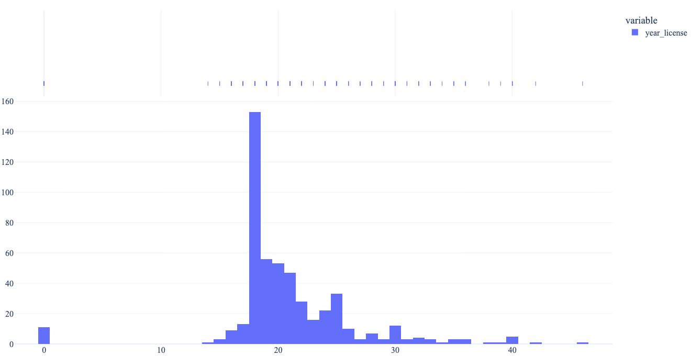
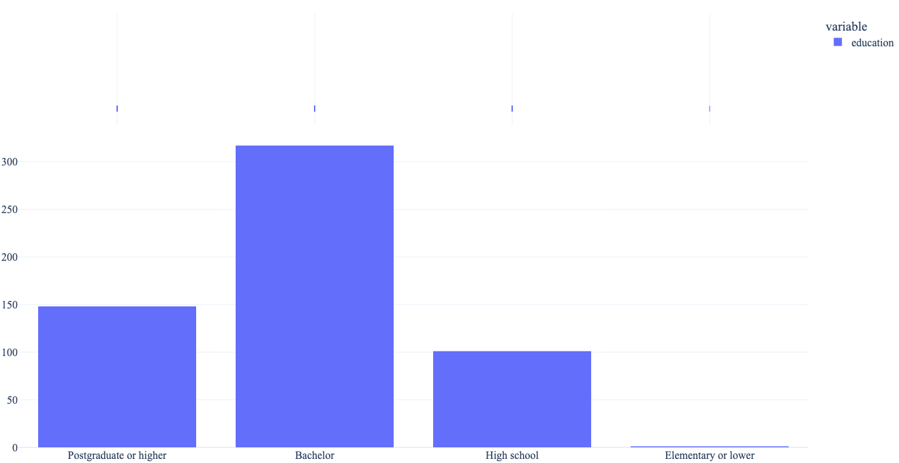
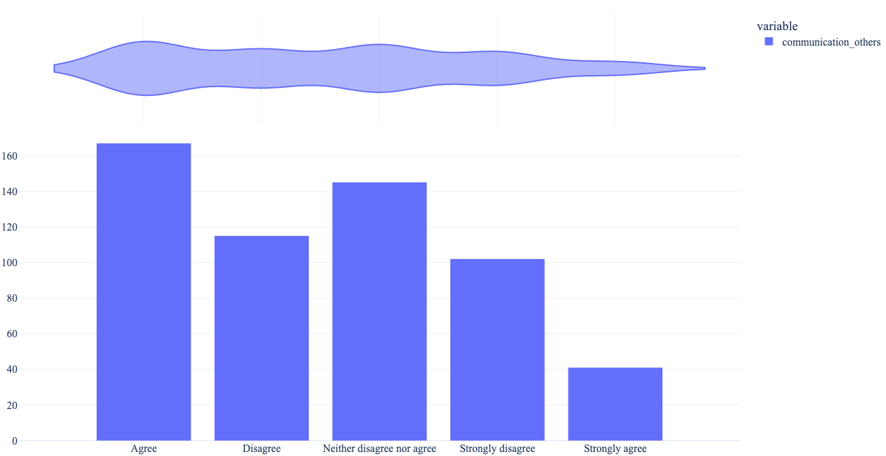
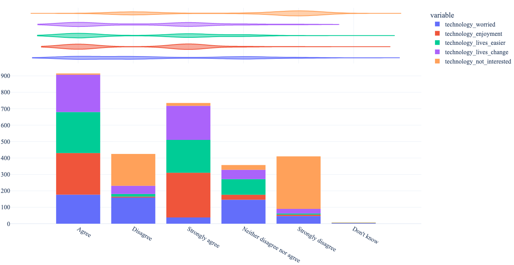
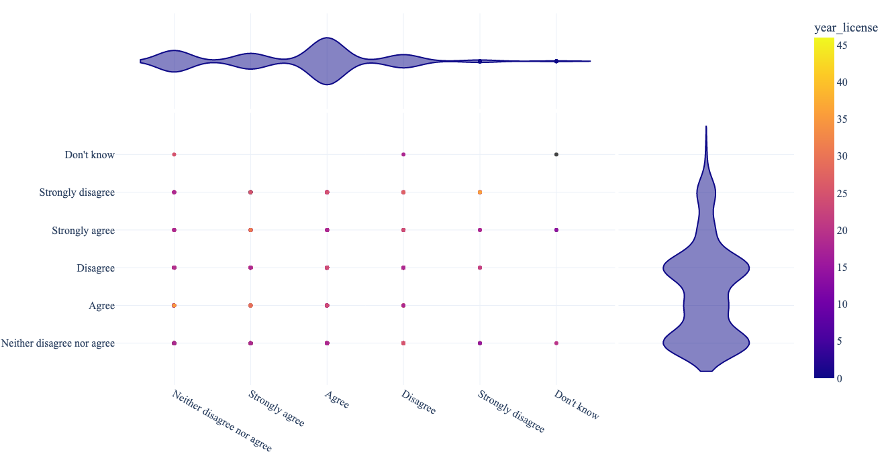
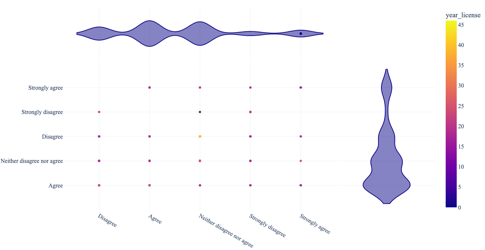
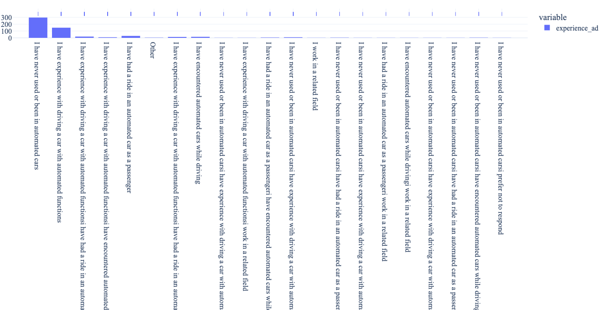
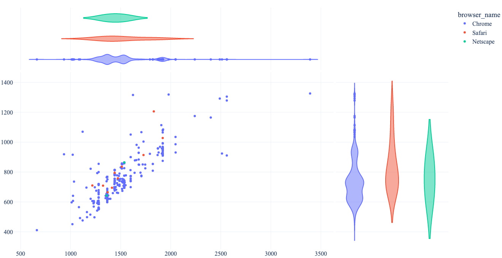

# Analysing trust in a traffic scene with an automated vehicle

This project defines a framework for the analysis of the level of trust in a traffic environment involving an automated vehicle. The jsPsych framework is used to for the frontend. In the description below, it is assumed that the repo is stored in the folder `trust-crowdsourced`. Terminal commands lower assume macOS.

## Setup
Tested with Python 3.9.12. To setup the environment run these two commands in a parent folder of the downloaded repository (replace `/` with `\` and possibly add `--user` if on Windows):
- `pip install -e trust-crowdsourced` will setup the project as a package accessible in the environment.
- `pip install -r trust-crowdsourced/requirements.txt` will install required packages.

### Configuration of project
Configuration of the project needs to be defined in `trust-crowdsourced/config`. Please use the `default.config` file for the required structure of the file. If no custom config file is provided, `default.config` is used. The config file has the following parameters:
* `appen_job`: ID of the appen job.
* `num_stimuli`: number of stimuli in the study.
* `num_stimuli_participant`: subset of stimuli in the study shown to each participant.
* `allowed_min_time`: the cut-off for minimal time of participation for filtering.
* `num_repeat`: number of times each stimulus is repeated.
* `kp_resolution`: bin size in ms in which data is stored.
* `allowed_stimulus_wrong_duration`: if the percentage of videos with abnormal length is above this value, exclude participant from analysis.
* `allowed_mistakes_signs`: number of allowed mistakes in the questions about traffic signs.
* `sign_answers`: answers to the questions on traffic signs.
* `mask_id`: number for masking worker IDs in appen data.
* `files_heroku`: files with data from heroku.
* `files_appen`: files with data from appen.
* `file_cheaters`: CSV file with cheaters for flagging.
* `path_source`: path with source files for the stimuli from the Unity3D project.
* `path_stimuli`: path consisting of all videos included in the survey.
* `mapping_stimuli`: CSV file that contains all data found in the videos.
* `plotly_template`: template used to make graphs in the analysis.
* `stimulus_width`: width of stimuli.
* `stimulus_height`: height of stimuli.
* `aoi`: csv file with AOI data.
* `separate_lab`: separate data from the lab experiment and crowdsourced experiments.
* `smoothen_signal`: toggle to apply filter to smoothen data.
* `freq`: frequency used by One Euro Filter.
* `mincutoff`: minimal cutoff used by One Euro Filter.
* `beta`: beta value used by One Euro Filter.
* `dcutoff`: d-cutoff value used by One Euro Filter.
* `font_family`: font family to be used on the figures.
* `font_size`: font size to be used on the figures.
* `p_value`: p value used for ttest.
* `save_figures`: save "final" figures to the /figures folder.

## Preparation of stimuli
The source files of the video stimuli are outputted from Unity to `config.path_source`. To prepare them for the crowdsourced setup `python trust-crowdsourced/preparation/process_videos.py`. Videos will be outputted to `config.path_stimuli`.

## Analysis
Analysis can be started by running python `trust-crowdsourced/trust/run.py`. A number of CSV files used for data processing are saved in `trust-crowdsourced/_output`. Visualisations of all data are saved in `trust-crowdsourced/_output/figures/`.

## Keypress data
### All participants

Percentage of participants pressing the response key as a function of elapsed video time for all stimuli for all participants.

Percentage of participants pressing the response key as a function of elapsed video time for groups of scenarios for all participants.

Percentage of participants pressing the response key as a function of elapsed video time for two types of ego car for all participants.

Percentage of participants pressing the response key as a function of elapsed video time for two types of target car for all participants.

Percentage of participants pressing the response key as a function of elapsed video time and responses to post-stimulus questions for scenario 0 (baseline) for all participants.

Percentage of participants pressing the response key as a function of elapsed video time and responses to post-stimulus questions for scenario 1 for all participants.

Percentage of participants pressing the response key as a function of elapsed video time and responses to post-stimulus questions for scenario 2 for all participants.

Percentage of participants pressing the response key as a function of elapsed video time and responses to post-stimulus questions for scenario 3 for all participants.

Percentage of participants pressing the response key as a function of elapsed video time and responses to post-stimulus questions for scenario 4 for all participants.

Percentage of participants pressing the response key as a function of elapsed video time and responses to post-stimulus questions for scenario 5 for all participants.

Percentage of participants pressing the response key as a function of elapsed video time and responses to post-stimulus questions for scenario 6 for all participants.

Percentage of participants pressing the response key as a function of elapsed video time and responses to post-stimulus questions for scenario 7 for all participants.

Percentage of participants pressing the response key as a function of elapsed video time and responses to post-stimulus questions for scenario 8 for all participants.

Percentage of participants pressing the response key as a function of elapsed video time and responses to post-stimulus questions for scenario 9 for all participants.

Percentage of participants pressing the response key as a function of elapsed video time and responses to post-stimulus questions for scenario 10 for all participants.

Percentage of participants pressing the response key as a function of elapsed video time and responses to post-stimulus questions for scenario 11 for all participants.

Percentage of participants pressing the response key as a function of elapsed video time and responses to post-stimulus questions for scenario 12 for all participants.

Percentage of participants pressing the response key as a function of elapsed video time and responses to post-stimulus questions for scenario 13 for all participants.

Percentage of participants pressing the response key as a function of elapsed video time and responses to post-stimulus questions for scenario 14 for all participants.

Percentage of participants pressing the response key as a function of elapsed video time and responses to post-stimulus questions for scenario 15 for all participants.

Percentage of participants pressing the response key as a function of elapsed video time and responses to post-stimulus questions for scenario 16 for all participants.

Percentage of participants pressing the response key as a function of elapsed video time and responses to post-stimulus questions for scenario 17 for all participants.

Percentage of participants pressing the response key as a function of elapsed video time and responses to post-stimulus questions for scenario 18 for all participants.

Percentage of participants pressing the response key as a function of elapsed video time and responses to post-stimulus questions for scenario 19 for all participants.

Percentage of participants pressing the response key as a function of elapsed video time and responses to post-stimulus questions for scenario 20 for all participants.

### For only lab participants
todo

#### Correlation and scatter matrices
  
Correlation matrix.

  
Scatter matrix.

## Area of Interest (AOI)
### For all participants

Plot of AOI analysis for video 0 for all participants.

Plot of AOI analysis for video 1 for all participants.

Plot of AOI analysis for video 2 for all participants.

Plot of AOI analysis for video 3 for all participants.

Plot of AOI analysis for video 4 for all participants.

Plot of AOI analysis for video 5 for all participants.

Plot of AOI analysis for video 6 for all participants.

Plot of AOI analysis for video 7 for all participants.

Plot of AOI analysis for video 8 for all participants.

Plot of AOI analysis for video 9 for all participants.

Plot of AOI analysis for video 10 for all participants.

Plot of AOI analysis for video 11 for all participants.

Plot of AOI analysis for video 12 for all participants.

Plot of AOI analysis for video 13 for all participants.

Plot of AOI analysis for video 14 for all participants.

Plot of AOI analysis for video 15 for all participants.

Plot of AOI analysis for video 16 for all participants.

Plot of AOI analysis for video 17 for all participants.

Plot of AOI analysis for video 18 for all participants.

Plot of AOI analysis for video 19 for all participants.

Plot of AOI analysis for video 20 for all participants.

### For only lab participants

Plot of AOI analysis for video 0 for lab participants.

Plot of AOI analysis for video 1 for lab participants.

Plot of AOI analysis for video 2 for lab participants.

Plot of AOI analysis for video 3 for lab participants.

Plot of AOI analysis for video 4 for lab participants.

Plot of AOI analysis for video 5 for lab participants.

Plot of AOI analysis for video 6 for lab participants.

Plot of AOI analysis for video 7 for lab participants.

Plot of AOI analysis for video 8 for lab participants.

Plot of AOI analysis for video 9 for lab participants.

Plot of AOI analysis for video 10 for lab participants.

Plot of AOI analysis for video 11 for lab participants.

Plot of AOI analysis for video 12 for lab participants.

Plot of AOI analysis for video 13 for lab participants.

Plot of AOI analysis for video 14 for lab participants.

Plot of AOI analysis for video 15 for lab participants.

Plot of AOI analysis for video 16 for lab participants.

Plot of AOI analysis for video 17 for lab participants.

Plot of AOI analysis for video 18 for lab participants.

Plot of AOI analysis for video 19 for lab participants.

Plot of AOI analysis for video 20 for lab participants.

#### Information on participants
  
Driving frequency.

  
Mileage.

  
Input device.

  
Driving behaviour questionnaire (DBQ).

  
Time of participation.

  
Year of obtaining driver's license.

  
Highest obtained level of education.

  
Responses to statement "I would like to communicate with other road users while driving (for instance, using eye contact, gestures, verbal communication, etc.)".

  
Technology acceptance scale.

  
Responses to x:"I enjoy making use of the latest technological products and services when I have the opportunity" and y:"New technologies are all about making profits rather than making people's lives better".

  
Responses to statement "Please indicate your general attitude towards automated cars".

  
Responses to x:"When the autonomous vehicle is on the road, I would feel comfortable about driving on roads alongside autonomous cars" and y:"When the autonomous vehicle is on the road, I would feel comfortable about
using an autonomous car instead of driving a traditional car.".

  
Responses to question "Who do you think is more capable of conducting driving-related tasks?"

  
Responses to question "Which options best describes your experience with automated cars?"

  
Map of counts of participants.

  
Map of years of having a license.

  
Map of prediction of the year of introduction of automated cars in the country of residence.

  
Map of age of participants.

  
Map of distribution of gender.

#### Technical characteristics of participants
  
Dimensions of browser.

## Troubleshooting
### Troubleshooting setup
#### ERROR: trust-crowdsourced is not a valid editable requirement
Check that you are indeed in the parent folder for running command `pip install -e trust-crowdsourced`. This command will not work from inside of the folder containing the repo.